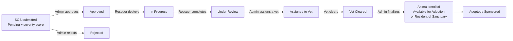

# 🐾 Heartbeat Heaven — Animal Rescue & Sanctuary Management System

A web platform for an animal welfare foundation in Bangladesh. It connects **the public, rescuers, veterinarians and sanctuary administrators** in one system — from the first street SOS report, through medical treatment and sanctuary enrollment, to adoption, sponsorship, donations and finance tracking.


---

## Table of Contents

- [Features](#features)
- [How a Rescue Works](#how-a-rescue-works)
- [Tech Stack](#tech-stack)
- [User Roles](#user-roles)
- [Project Structure](#project-structure)
- [Getting Started](#getting-started)
- [Configuration](#configuration)
- [Security Notes](#security-notes)
- [Acknowledgements](#acknowledgements)

---

## Features

### 🚨 Rescue operations
- **SOS reporting** for logged-in users *and* guests — species, description, location, phone/email and a required photo or video.
- **AI-assisted triage** — every report gets a severity score from **1 (Minimal) to 5 (Critical)**. A keyword scorer runs first; a Groq-hosted LLM then refines the score (it understands Bengali, English or a mix), and the higher of the two is kept. Without an API key, or with triage switched off, the keyword score is used.
- **Rescuer HQ** — approved street SOS cases sorted by severity, clinic-transfer pickups, active operations (with field-cost entry), mission history with date filters and print, and **self-logged rescues**.
- **Rescue Command** for admins — tabs for Pending SOS, At Clinics, In Progress, Under Review, Under Treatment, Vet Cleared and Rejected; approve/reject, assign a vet, finalize, restore, and filter by severity, rescuer or vet.
- **Clinic arrival reports** with a photo, when an animal is taken straight to a clinic.

### 🩺 Medical care
- **Vet dashboard ("Medical Command")** — assigned patients with editable species, breed, age, gender, vaccination and spay/neuter status, clinical notes and treatment cost; status is set to *Under Treatment* or *Ready for Release (Cleared)*.
- **Clearance records** with search, species and date filters, and print.
- **Hybrid Rescue Finder** — an interactive map that combines the sanctuary's partner clinics with nearby veterinary clinics from OpenStreetMap (within about 6 km of the visitor).
- **Vet partner management** — register clinics with license number, GPS coordinates, specialty, 24/7 and verified flags.

### 🏡 Sanctuary, adoption & surrender
- **Animal gallery** — filter tabs (*All / Ready for Home / Sanctuary*), live search by name, species, breed or gender, medical-clearance badges, vet notes and a photo lightbox.
- **Adoption applications** — a detailed form (housing, outdoor space, other pets, children, experience, hours alone, agreement to standards). Admins schedule an appointment, then confirm the handover (the animal becomes *Adopted*; other applicants are rejected and emailed) or reject. Applicants can cancel while pending.
- **Surrender requests** — an "have you explored every option" checklist, pet details with a required photo, urgency, contact-time preference and an optional pledged contribution. Admins schedule a drop-off, then mark the pet as received and place it in the adoption list or the sanctuary; the collected contribution is logged to finance.
- **Resident enrollment** — after vet clearance, an admin enrolls the animal as *Available for Adoption* or *Resident of Sanctuary* and picks the photo focus point for its card.

### 💛 Community & funding
- **Donations** (minimum ৳10) through **SSLCommerz**, with an automatically generated **PDF receipt** (`RCP-YYYY-NNNNN`).
- **Animal sponsorships** for sanctuary residents — ৳500 / ৳1,000 / ৳2,000 or a custom amount (minimum ৳100), paid through SSLCommerz and activated after admin approval.
- **Events** — public listing of upcoming events with an "I'm interested" toggle and live interest counts.
- **Vacancies** — public job board (Medical, Rescue, Management); logged-in users apply with a cover note and CV link.
- **Notices**, community **testimonials** (moderated), a home-page **gallery** and daily **quotes**, plus a **pet guidelines** knowledge base.
- **Chat widget** with an **AI assistant** (Groq) and a **Rescue Team** message tab.
- **Personal Activity Hub** — each member's adoptions, sponsorships, donations, SOS history, surrenders, event registrations and job applications, with impact totals.
- **Profile management** — photo upload or animal avatars, password change, resignation request (vets and rescuers) and account deletion.

### 📊 Administration
- **Admin dashboard** with live counters and shortcuts to every management area.
- **User directory** by role (admins, vets, rescuers, general users) with restrict/unrestrict, demote, edit and delete, plus an **activity leaderboard**.
- **HR operations** — post vacancies, review applications, hire (the applicant's role is updated and they are emailed), reject, and handle resignations.
- **Content manager** — gallery, quotes and testimonial moderation.
- **Event manager** — create, edit and delete events; view each event's participants.
- **Finance module**
  - *Funding sources:* General Donation, Sponsorship, Grant, SOS Campaign, Partner Clinic, Surrender Contribution, Owner Capital.
  - *Expense categories:* Medical, Food & Supplies, Facility Maintenance, Rescue Ops, Staff Salaries, Event Management, Admin.
  - Overview dashboard with charts (funding streams, expenditure by category, 6-month trend), a searchable, filterable, printable **ledger**, and **sponsorship management** (approve, reject, add manually, history).
  - Vet treatment costs, rescuer field costs, donations and surrender contributions are **logged automatically**.
- **System settings** — general site info, security policy, SMTP email, AI & chatbot, notification toggles, notice management and a **maintenance mode** switch.
- **Printable reports** throughout (lists, ledger, user activity reports).

---

## How a Rescue Works



Animals taken directly to a clinic are reported as **At Clinic** and can be approved for a rescuer's clinic-transfer pickup. Rescues logged by a rescuer themselves enter the flow at **Under Review**.

---

## Tech Stack

| Layer | Technology |
|---|---|
| Backend | PHP 8+ (procedural), MySQLi |
| Database | MySQL / MariaDB (`moonlight_db`) |
| Frontend | HTML5, CSS3, JavaScript, Bootstrap 5.3, Font Awesome, Chart.js, SweetAlert2 |
| Maps | Leaflet.js, OpenStreetMap tiles, Overpass API |
| AI | Groq API (`llama-3.1-8b-instant`) for the chatbot and SOS triage |
| Payments | SSLCommerz payment gateway |
| Email | PHPMailer (SMTP, configured from the admin panel) |
| PDF | FPDF |

---

## User Roles

| Role | Landing page | What they can do |
|---|---|---|
| **Visitor** | `index.php` | Browse animals, events, vacancies, guidelines and the vet finder; send an SOS; use the chatbot; register or log in |
| **User** | `user.php` | Everything a visitor can, plus view notices, donate, sponsor, apply to adopt, request surrender, register interest in events, apply for vacancies and use the activity hub |
| **Rescuer** | `rescuer.php` | Deploy on approved SOS cases, pick up clinic transfers, complete missions, log independent rescues |
| **Vet** | `vet_dashboard.php` | Treat assigned cases, record notes and costs, issue medical clearance |
| **Admin** | `admin.php` | Manage all data, finances, content and system settings |

- New accounts always start as **User**. Vets and rescuers get their role when an admin **hires** them from a Medical or Rescue vacancy application; admins can also change roles from *Edit Member*.
- Admins can **restrict** an account, which blocks login.

---

## Project Structure

```text
.
├── index.php                 # Public landing page
├── login.php / register.php  # Authentication (Gmail + OTP verification, password reset)
├── user.php                  # User hub
├── rescuer.php               # Rescuer HQ
├── vet_dashboard.php         # Vet dashboard
├── admin.php                 # Admin dashboard
├── manage_*.php              # Admin pages (users, animals, rescues, events, vacancies, clinics, donations, contents)
├── finance_*.php             # Finance overview, ledger, income/expense logging, sponsorships
├── process_*.php             # Action handlers (SOS, adoption, surrender, login, finalization, ...)
├── ssl_pay.php, sponsor_*.php, payment_success.php   # SSLCommerz payment flow
├── chat_widget.php, chat_handler.php                 # AI chatbot and team chat
├── generate_receipt.php      # PDF receipt generator
├── notifications.php, mailer.php                     # Email notifications
├── db_config.php             # DB connection + system settings loader
├── security.php              # Session timeout + password policy
├── navbar.php, footer.php, style.css
├── src/                      # PHPMailer
├── fpdf/                     # FPDF library
├── receipts/                 # Generated PDF receipts
└── uploads/                  # animals, events, gallery, profiles, rescues, rescue_updates, surrender
```

---

## Getting Started

### Prerequisites

- **PHP 8.0 or newer** with the `mysqli`, `curl` and `fileinfo` extensions
- **MySQL 5.7+ / MariaDB 10.3+**
- **Apache** (XAMPP, WAMP or Laragon work well)
- Internet access — Bootstrap, Font Awesome, Leaflet, Chart.js, SweetAlert2 and the map tiles load from CDNs

### Installation

1. **Clone the repository into your web root**, using the folder name `Moonlight_of_Heaven` (the payment callback URLs expect it):

   ```bash
   cd /path/to/htdocs
   git clone https://github.com/MashrubaTasnim/Animal-Rescue-Sanctuary-Management-System.git Moonlight_of_Heaven
   ```

2. **Create the database**:

   ```sql
   CREATE DATABASE moonlight_db CHARACTER SET utf8mb4 COLLATE utf8mb4_unicode_ci;
   ```

3. **Import the schema** from `database/moonlight_db.sql`:

   ```bash
   mysql -u root -p moonlight_db < database/moonlight_db.sql
   ```

   The application expects these tables: `users`, `rescues`, `animals`, `adoption_requests`, `surrender_requests`, `donations`, `resident_sponsorships`, `funding_income`, `sanctuary_expenses`, `events`, `event_interests`, `vacancies`, `job_applications`, `vet_clinics`, `notices`, `gallery`, `testimonials`, `site_quotes`, `messages` and `system_settings`.

   To inspect the live schema at any time, open `http://localhost/Moonlight_of_Heaven/db_structures.php`.

4. **Set your database credentials** in `db_config.php` (defaults: `localhost`, user `root`, empty password, database `moonlight_db`). `send_message.php` and `get_messages.php` open their own connection, so update them too if you change the credentials.

5. **Make the folders writable:** `uploads/` (with its subfolders) and `receipts/`.

6. **Start Apache and MySQL**, then open:

   ```
   http://localhost/Moonlight_of_Heaven/
   ```

### Creating the first admin

1. Add your SMTP details to the `system_settings` table (see [Configuration](#configuration)) — registration sends a 6-digit OTP by email.
2. Register a normal account at `register.php`. **Registration is limited to `@gmail.com` addresses.**
3. Promote it:

   ```sql
   UPDATE users SET role = 'admin' WHERE email = 'you@gmail.com';
   ```

4. Log in — you land on the admin dashboard. Every other setting is managed from **Admin → System Settings**.

---

## Configuration

Most options live in the `system_settings` table (`setting_key`, `setting_val`) and are editable at **Admin → System Settings**:

| Section | Keys |
|---|---|
| General | `site_name`, `site_tagline`, `site_description`, `sanctuary_address`, `contact_email`, `facebook_url`, `instagram_url`, `maintenance_mode` |
| Security | `session_timeout_minutes`, `password_min_length`, `pw_require_upper`, `pw_require_number`, `pw_require_special` |
| Email / SMTP | `smtp_host`, `smtp_port`, `smtp_username`, `smtp_password`, `smtp_sender_name` |
| AI & Chatbot | `groq_api_key`, `chatbot_enabled`, `chatbot_system_prompt`, `chatbot_fallback_message`, `triage_enabled`, `triage_low_threshold`, `triage_medium_threshold` |
| Notifications | `notify_sos`, `notify_adoption`, `notify_jobs` |

### Groq (chatbot & SOS triage)
Create an API key at [console.groq.com](https://console.groq.com) and save it as `groq_api_key`. Never commit real keys to the repository.

### SSLCommerz (payments)
`ssl_pay.php` and `sponsor_payment.php` ship with SSLCommerz **sandbox** test credentials and the sandbox endpoint. For production:

1. Replace `store_id` / `store_passwd` with your live credentials.
2. Switch the API URL from `sandbox.sslcommerz.com` to the live endpoint.
3. Change `$base_url` in both files from `http://localhost/Moonlight_of_Heaven/` to your public HTTPS domain.

### Email (SMTP)
PHPMailer sends OTP codes, password-reset codes and status notifications (SOS, adoption, surrender, sponsorship, job applications). Any STARTTLS SMTP provider works — for Gmail, use an app password on port `587`.

---

## Security Notes

- Passwords are stored with `password_hash()` and checked with `password_verify()`; the session ID is regenerated on login.
- Session timeout and password strength rules are configurable and enforced site-wide.
- Admin, rescuer and vet pages are protected by role checks, and admins can restrict accounts.
- The profile page uses CSRF tokens.
- This is a development build. Before deploying publicly: use a dedicated database user instead of `root`, serve the site over HTTPS, keep API keys and SMTP passwords out of source control, remove `db_structures.php`, and review the code paths that handle payment callbacks and file uploads.

---

## Acknowledgements

[PHPMailer](https://github.com/PHPMailer/PHPMailer) · [FPDF](http://www.fpdf.org/) · [Bootstrap](https://getbootstrap.com/) · [Font Awesome](https://fontawesome.com/) · [Leaflet](https://leafletjs.com/) · [OpenStreetMap](https://www.openstreetmap.org/) & [Overpass API](https://overpass-api.de/) · [Chart.js](https://www.chartjs.org/) · [SweetAlert2](https://sweetalert2.github.io/) · [RoboHash](https://robohash.org/) · [Groq](https://groq.com/) · [SSLCommerz](https://www.sslcommerz.com/)
